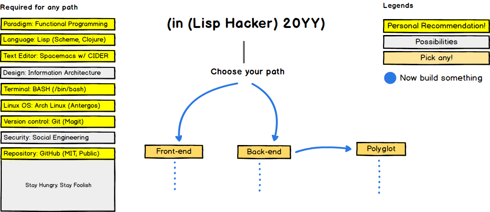
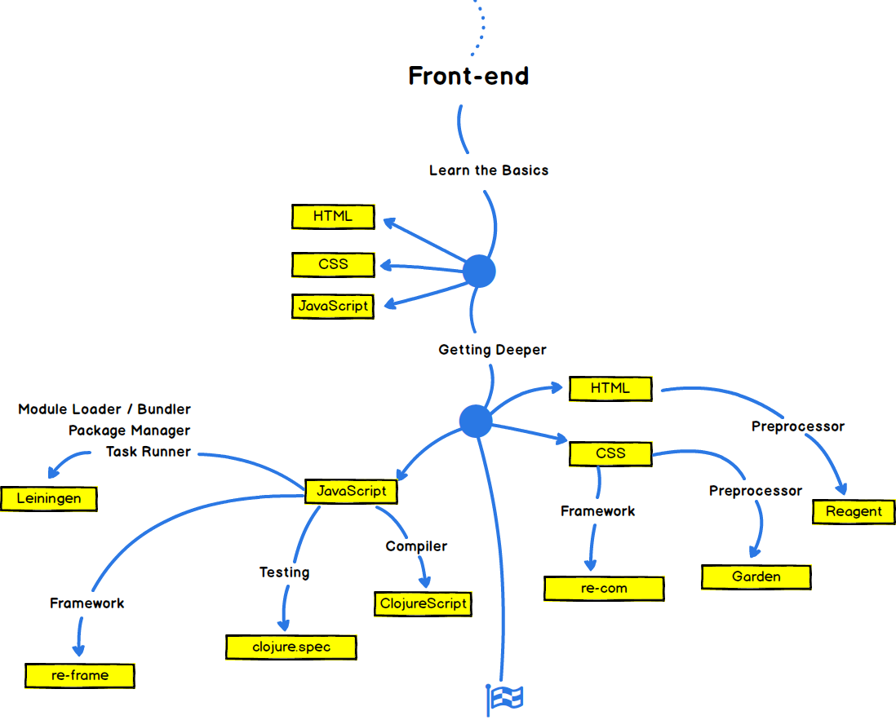
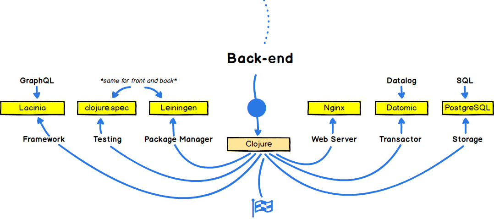

lisp-hacker-roadmap
===================

-------------------------------------------------------------------------------

> La perfection est atteinte, non pas lorsqu'il n'y a plus rien à ajouter, mais lorsqu'il n'y a plus rien à retirer.
>
> Perfection is achieved, not when there is nothing more to add, but when there is nothing left to take away.
>
> &mdash; Antoine de Saint-Exupéry

-------------------------------------------------------------------------------

Below are charts that show possible paths to be a practical yet bleeding edge Lisp hacker.
The specified technologies were carefully chosen to be as minimal as possible yet able to work completely harmonious with each other; from front to back.
The polyglot aspect can be optional but the rewards will be great and surely will make you a better hacker, not just in Lisp, for the rest of your days.

Suggestions are always welcome.

-------------------------------------------------------------------------------

🚀 Introduction
---------------

-------------------------------------------------------------------------------

🎨 Front-end Roadmap
--------------------

-------------------------------------------------------------------------------

👽 Back-end Roadmap
-------------------

-------------------------------------------------------------------------------

## 👷 Polyglot Roadmap

-------------------------------------------------------------------------------

Credits
-------

Credit goes to [@kamranahmedse] for his [developer-roadmap].

-------------------------------------------------------------------------------

License
-------

`lisp-hacker-roadmap` is licensed under [MIT].

[@kamranahmedse]: https://github.com/kamranahmedse
[developer-roadmap]: https://github.com/kamranahmedse/developer-roadmap
[MIT]: ./LICENSE.md
