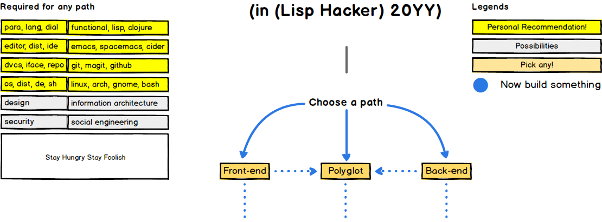
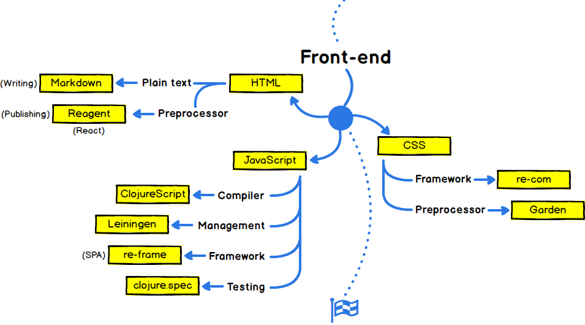
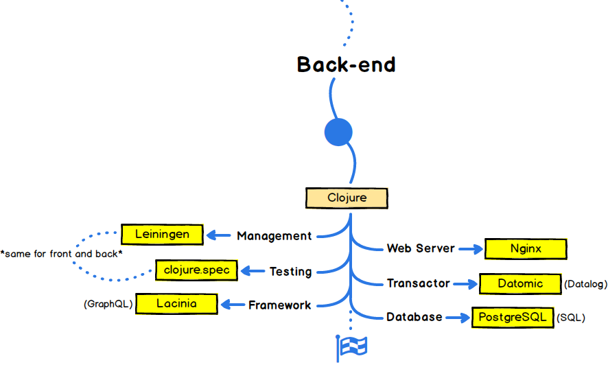
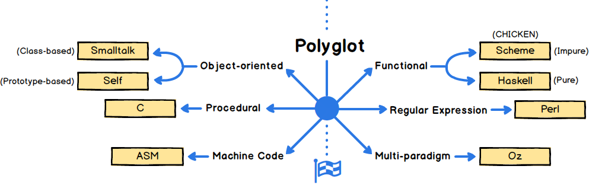

lisp-hacker-roadmap
===================

-------------------------------------------------------------------------------

> La perfection est atteinte, non pas lorsqu'il n'y a plus rien à ajouter, mais lorsqu'il n'y a plus rien à retirer.
>
> Perfection is achieved, not when there is nothing more to add, but when there is nothing left to take away.
>
> &mdash; Antoine de Saint-Exupéry

-------------------------------------------------------------------------------

Below are charts that show possible paths to be a practical yet bleeding edge Lisp hacker.
The specified technologies were carefully chosen to be as minimal as possible yet able to work completely harmonious with one another; from front to back.

The polyglot offers vast amounts of enlightenment. The experience will make you a better hacker for the rest of your days.

Suggestions are always welcome.

-------------------------------------------------------------------------------

🚀 Introduction
---------------

| Categories                         | Technologies                |
| :--------------------------------- | :-------------------------- |
| Para(digm)                         | Functional (Programming)    |
| Lang(uage)                         | Lisp                        |
| Dial(ect)                          | Clojure                     |
| (Text) Editor                      | Emacs                       |
| Dist(ribution)                     | Spacemacs                   |
| Integrated Development Environment | CIDER                       |
| Distributed Version Control System | Git                         |
| I(nter)face                        | Magit                       |
| Repo(sitory)                       | GitHub                      |
| Operating System                   | Linux                       |
| Dist(ribution)                     | Arch (Linux)                |
| Desktop Environment                | GNOME                       |
| Sh(ell)                            | BASH                        |
| Design                             | Information Architecture    |
| Security                           | Social Engineering          |

-------------------------------------------------------------------------------

🎨 Front-end
------------

### HTML ###

| Categories                         | Technologies                |
| :--------------------------------- | :-------------------------- |
| Markup (Writing)                   | Markdown                    |
| Preprocessor (React, Publishing)   | Reagent                     |

### CSS ###

| Categories                         | Technologies                |
| :--------------------------------- | :-------------------------- |
| Preprocessor                       | Garden                      |
| Framework                          | re-com                      |

### JavaScript ###

| Categories                         | Technologies                |
| :--------------------------------- | :-------------------------- |
| Compiler                           | ClojureScript               |
| Management                         | Leiningen                   |
| Framework (SPA)                    | re-frame                    |
| Testing                            | clojure.spec                |

-------------------------------------------------------------------------------

👽 Back-end
-----------

| Categories                         | Technologies                |
| :--------------------------------- | :-------------------------- |
| Language                           | Clojure                     |
| Management                         | Leiningen                   |
| Testing                            | clojure.spec                |
| Framework (GraphQL)                | Lacinia                     |
| Web Server                         | Nginx                       |
| Transactor (Datalog)               | Datomic                     |
| Database (SQL)                     | PostgreSQL                  |

-------------------------------------------------------------------------------

👷 Polyglot
-----------

| Categories                         | Technologies                |
| :--------------------------------- | :-------------------------- |
| Functional (Impure)                | Scheme (CHICKEN)            |
| Functional (Pure)                  | Haskell                     |
| Object-oriented (Class)            | Smalltalk                   |
| Object-oriented (Prototype)        | Self                        |
| Regular Expression                 | Perl                        |
| Multi-paradigm                     | Oz                          |
| Procedural                         | C                           |
| Machine Code                       | ASM                         |

-------------------------------------------------------------------------------

Credits
-------

Credit goes to [@kamranahmedse] for his [developer-roadmap].

-------------------------------------------------------------------------------

License
-------

`lisp-hacker-roadmap` is licensed under [MIT].

[@kamranahmedse]: https://github.com/kamranahmedse
[developer-roadmap]: https://github.com/kamranahmedse/developer-roadmap
[MIT]: ./LICENSE.md
