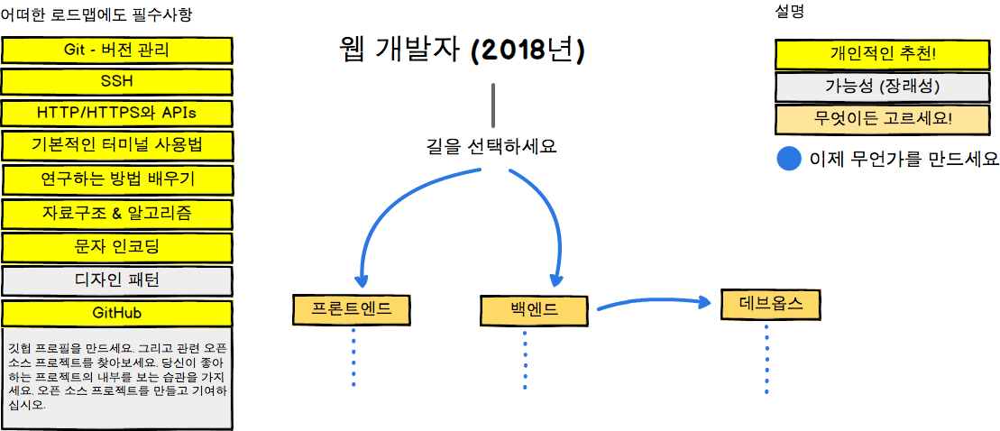
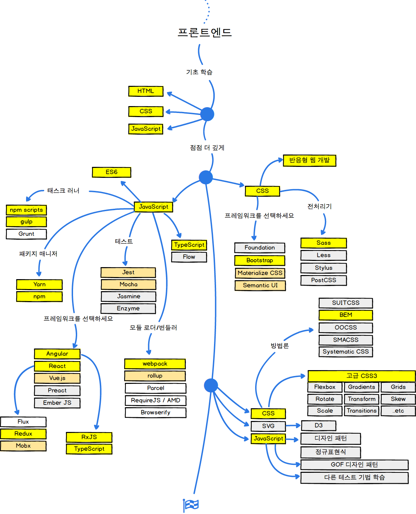
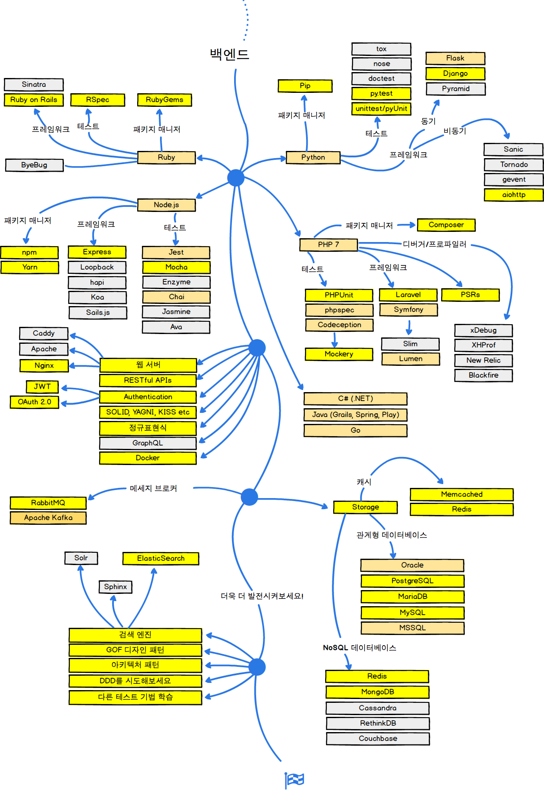
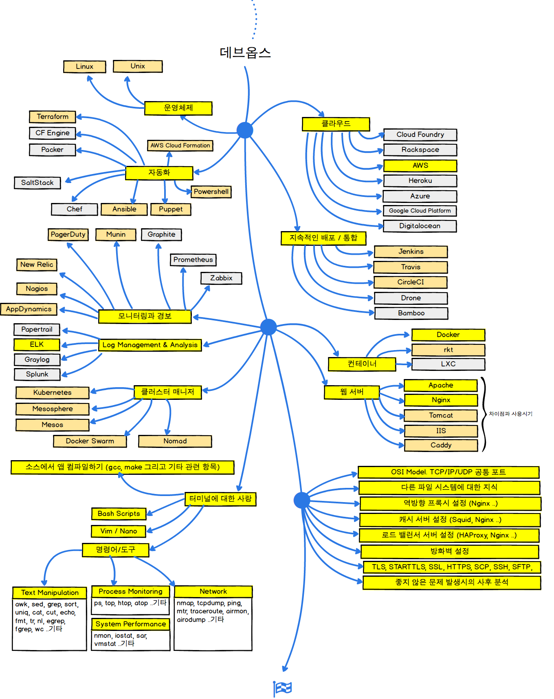

> 2018년 웹 개발자가 되기 위한 로드맵

아래에는 프론트 엔드, 백엔드 또는 데브옵스가 되기 위해 표시된 경로와 사용하고자 하는 기술을 보여 주는 차트가 있습니다. 저는 이 차트를 그의 대학생들과 무언가를 공유해서 그들에게 관점을 주고 싶어 하는 나의 옛 교수님과 함께 만들었습니다.

If you think that these can be improved in anyway, please do suggest.

***

<b> Did you like this guide and want more of the similar content? </b> Subscribe for the launch of <a href="http://hugobots.com">Hugobots</a> or <a href="http://twitter.com/kamranahmedse">follow me on twitter</a>!

***

## 🚀 소개

## 🎨 프론트엔드 로드맵

## 👽 백엔드 로드맵

For the backend, personally I would prefer Node.js and PHP 7 for the full time. Plus, I have been experimenting lately with Go and I quite like it. Apart from these, if I have to choose another one, I would go for Ruby. However this is just my personal preference, you can choose any of the shown languages and you will be good.

## 👷 데브옵스 로드맵

 

## 🚦 마무리

If you think any of the roadmaps can be improved, please do open a PR with any updates and submit any issues. Also, I will continue to improve this, so you might want to watch/star this repository to revisit.

## ☑ 할 일

- [X] Add Frontend Roadmap
- [X] Add Backend Roadmap
- [X] Add DevOps Roadmap
- [ ] Add relevant resources for each

## 👬 기여하기

The roadmaps are built using [Balsamiq](https://balsamiq.com/products/mockups/). Project file can be found at `/project-files` directory. To modify any of the roadmaps, open Balsamiq, click **Project > Import > Mockup JSON**, it will open the roadmap for you, update it, upload and update the images in readme and create a PR.		

- Open pull request with improvements
- Discuss ideas in issues
- Spread the word
- Reach out with any feedback 

## 스폰서

- [Hackr.io - Find & Share the Best Online Programming Courses & Tutorials](https://hackr.io)
- [Highig - Think and its done](http://highig.com/)

## 라이센스

