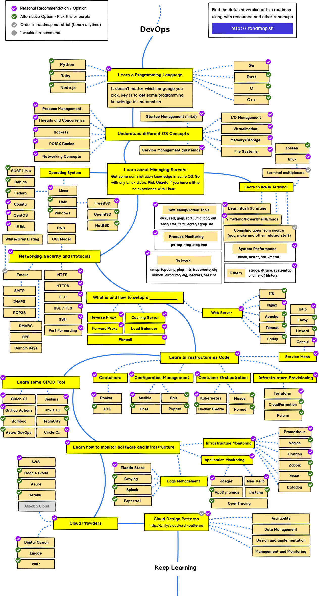

> Roadmap to becoming a web developer in 2021

Below you find a set of charts demonstrating the paths that you can take and the technologies that you would want to adopt in order to become a frontend, backend or a devops. I made these charts for an old professor of mine who wanted something to share with his college students to give them a perspective; sharing them here to help the community.

***

		Special Announcement:
		 
		
		 
		<b>We now have a YouTube Channel</b>
		 
		I plan on covering the roadmaps and put more content there <a href="https://www.youtube.com/channel/UCA0H2KIWgWTwpTFjSxp0now?sub_confirmation=1">Subscribe to the channel</a>.

***

<h3 align="center"><strong>Purpose of these Roadmaps</strong></h3>

> The purpose of these roadmaps is to give you an idea about the landscape and to guide you if you are confused about what to learn next and not to encourage you to pick what is hip and trendy. You should grow some understanding of why one tool would be better suited for some cases than the other and remember hip and trendy never means best suited for the job.

<h3 align="center"><strong>Note to Beginners</strong></h3>

> These roadmaps cover everything that is there to learn for the paths listed below. Don't feel overwhelmed, you don't need to learn it all in the beginning if you are just getting started. We are working on the beginner versions of these and will [release it soon](https://roadmap.sh) after we are done with the 2021 release of the Backend and DevOps roadmaps.

***

If you think that these can be improved in any way, please do suggest.

## Introduction

## Frontend Roadmap

 

## Back-end Roadmap 

 

## DevOps Roadmap

 

## 🚦 Wrap Up

If you think any of the roadmaps can be improved, feel free to discuss it in the issues. Also, I will continue to improve this, so you might want to watch this repository or subscribe at [roadmap.sh](http://roadmap.sh) to revisit.

## 🙌 Contribution

> Have a look at [contribution docs](./CONTRIBUTING.md) for how to update any of the roadmaps

- Open pull request with improvements
- Discuss ideas in issues
- Spread the word
- Reach out with any feedback 
 
## License

Have a look at the [license file](./LICENSE) for details
