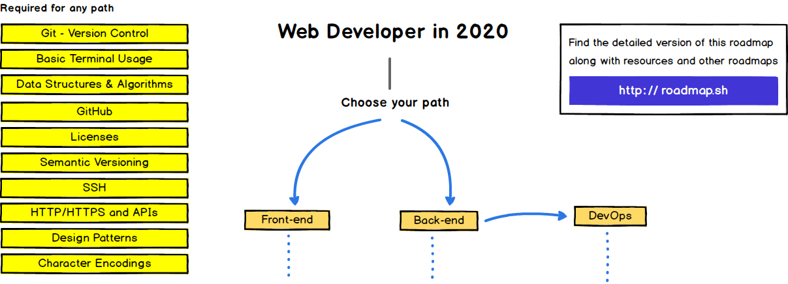
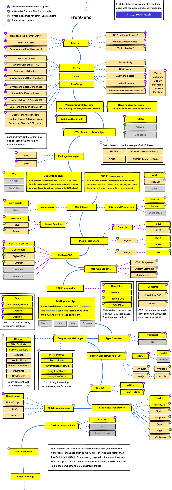
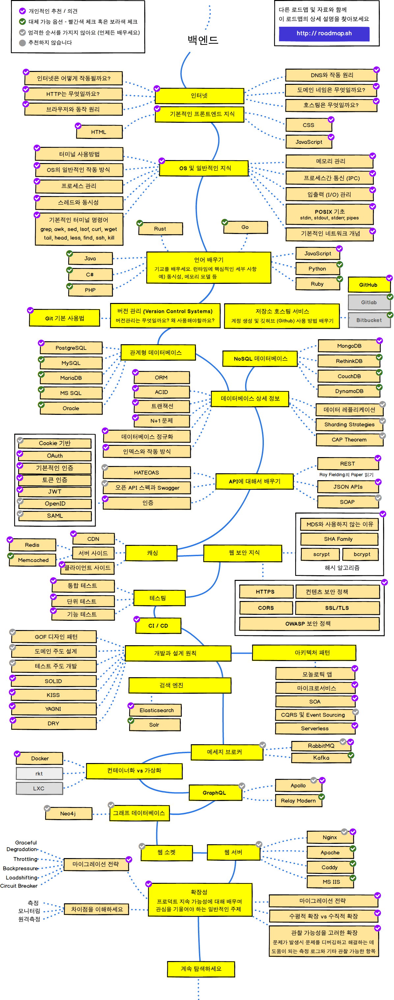

> 2020년 웹 개발자가 되기 위한 로드맵

아래에는 프론트엔드 및 백엔드 또는 데브옵스가 되기 위한 경로와 사용하고자 하는 기술을 보여 주는 로드맵이 있습니다.
저는 제자들의 시야를 넓히고자 하는 옛 교수님을 위해 이 로드맵을 만들었습니다. 누구나 커뮤니티를 돕기 위해 이곳에 공유해주세요.

***

<h3 align="center"><strong>로드맵의 목적</strong></h3>

> 이 로드맵의 목적은 전체적인 방향에 대한 아이디어를 제공하고  
다음에 무엇을 배워야 할지 혼란스러울 경우와 트렌드에 뒤떨어진 것을 배우지 않도록 안내하는 것입니다.  
왜 어떤 도구가 다른 도구보다 적합하다고 생각되는지에 대한 이해를 넓혀 가야 하며  
유행에 따른 도구를 기억하는 것이 결코 직업에 가장 적합한 것은 아니라는 것을 기억해야 합니다.

<h3 align="center"><strong>초보자를 위한 참고사항</strong></h3>

> 이 로드맵은 아래에 나열된 경로에 대해 학습할 수 있는 모든 내용을 담고 있습니다.  
압도당하지 마세요! 시작부터 모든 것을 처음부터 끝까지 다 배울 필요는 없습니다.  
초보자들을 위한 버전을 작업하고 있으며 2020년 백엔드 및 데브옵스 로드맵을 완료한 후 출시할 예정입니다.

***

로드맵이 개선될 수 있다면 제안해주세요.

## 소개

## 프론트엔드 로드맵

 

## 백엔드 로드맵

 

## 데브옵스 로드맵

 

## 🚦 마무리

로드맵을 개선을 위해 언제든지 이슈를 통해 의견을 주세요.

또한 이 로드맵은 계속해서 개선할 예정이기 때문에 저장소를 `watch` 하거나 [roadmap.sh](http://roadmap.sh)를 구독하여 재방문할 수 있습니다.

## 🙌 기여하기

> 로드맵을 업데이트하는 방법은 [기여 문서](./contributing.md)를 살펴보세요.

- 개선사항은 pull request
- 논의사항은 issues
- 널리 공유해주세요
- 피드백을 보내주세요 

## 라이센스

Have a look at the [license file](./license.md) for details
