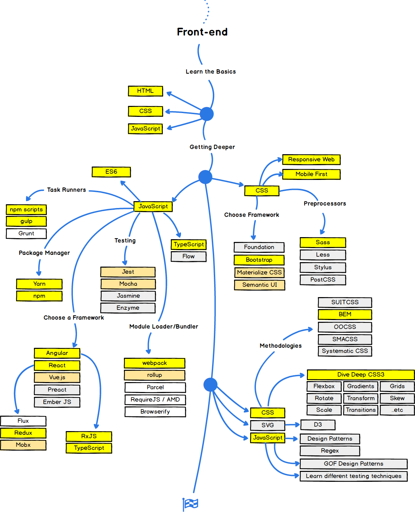
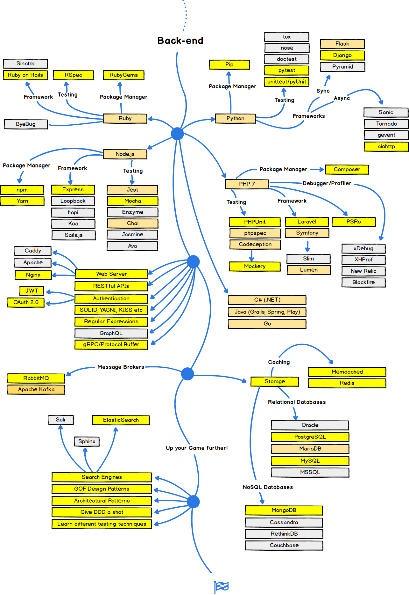
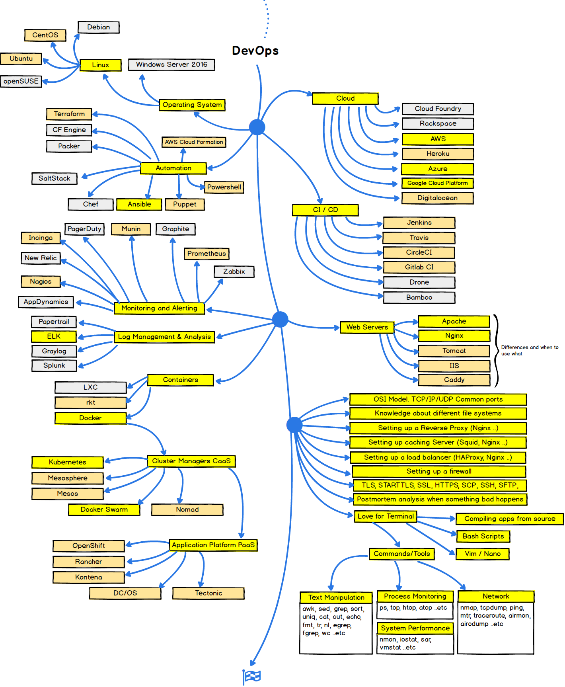

Hey guys, this is a fork from [kamranahmedse](https://github.com/kamranahmedse/developer-roadmap)

***

I have made some changes and add some small stuff which I will show for the different sections seperatly.

***

## 🚀 Introduction

I leave the introduction as it is, but I need to say I have some major concerns about this Back-end -> DevOps step. In my opinion you also need an additional part about "Ops", as there is much more than just run an operating system. You are also required to understand and manage things like backups, storage technologies, networking etc. I know this picture is getting quite complex then and it also doesnt't fit fully to the title but at least it would show the full picture.

## 🎨 Front-end Roadmap

I add here only the CSS -> "Mobile First" part. Maybe it is on the wrong place. However, I think nowerdays it is even more important to optimize a website for mobile use and then focus on everything else. Responsive Web maybe include the mobile first thing, but again I think the importance of it should be also pointed clear.

## 👽 Back-end Roadmap

I think whomever you will ask about what is the best or valuable programming language you will have in the ende every language as an answer. So just take GO it's the best for many cases! :P Kidding, but <3 for Gophers.

Now to the changes:
- take Docker out, I think this hasn't something common with back-end development, otherwise you need to add cloud stuff like AWS or Google Cloud Platform as you can build with easy your back-end on it too
- added gRPC respective Protocol Buffer, this things will have an interesting future as you can define in a protocol buffer ones how the interface will looks like and you can generate the code for many programming languages. Additionalay the protocol buffer is also the documentation of the interfaces.
- get Redis out of the NoSQL, yes it is a kind of, but basically you can throw in every non RDBS in a NoSQL category
- Make some recommendation changes the RDBS, Oracle/MSSQL imho no needs today to lear it, but good to know them. If Maria or MySQL is no big difference, so I would set my coin on the current market giant MySQL and keep MariaDB in mind.
- A comment to Apache Kafka: I basically love this thing as you can make really cool stuff with it (query stream data, or plug a ML on top of the stream), not only Pub/Sub. But for smaller or medium projects it's is not valuable to have a Kafka as the cluster will have a unecassary overhead. BUT, take a look at it, just can recommend it!!!

## 👷 DevOps Roadmap

- throw unix out and add Windows Server 2016, no I'm not crazy, ok maybe but you can run Docker on the Windows Server 2016 to run within Docker Windows applications. (Not a big fan of it)
- Also add some linux distributions
- Cloud: Marked Azure and GCP also as recommended as Azure is in big companies quite relevant (thx to really awesome deals...) and GCP is up an in the hunt to AWS and imho much more easier and partly cheaper as AWS. Heroku and DO are quite relevant for fast hosting and test something.
- CI/CD, added Gitlab CI, easy to use, directly at your code base, free, and it is basically made to build pipes in context of docker!
- Monitoring: Marked Prometheus as to choose, I think it is the tool for monitoring at the moment, fast, robust, reliable. Took New Relic and AppDynamics just as additional, they are commercial and not for everyone relevant. Added Incinga as it is not anymore a fork of Nagios and really lightweight it should be considered.
- Restructured the part of containers and love for terminal to make more space
- Cluster Manager CaaS: Marked Kubernetes and Swarm as required. Swarm comes natively with Docker and is for a small setup good. Kubernetes is going to be a standard, but it has some trade offs as you need to build a lot of stuff arroung it to make it fully usable for companies (maybe should be added)
- Added Application Platforms PaaS: Well CaaS is already a old peace of cake. If you just want to get your docker clusters up and running and dont build some monthes your infrastructure, then choos one of the PaaS. A Rancher or Kontena are really easy for the beginning. Want to go big? OpenShift, Tectonic and DC/OS are waiting. 
- Container could have some additional topics like, Container OSs, container security & scanning, container monitoring and management etc. 

 

## 👬 Contribution

The roadmaps are built using [Balsamiq](https://balsamiq.com/products/mockups/). Project file can be found at `/project-files` directory. To modify any of the roadmaps, open Balsamiq, click **Project > Import > Mockup JSON**, it will open the roadmap for you, update it, upload and update the images in readme and create a PR.		

- Open pull request with improvements
- Discuss ideas in issues
- Spread the word

## License

