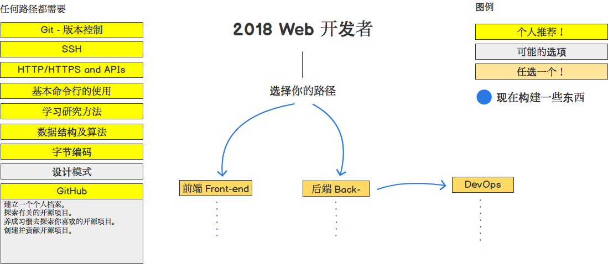
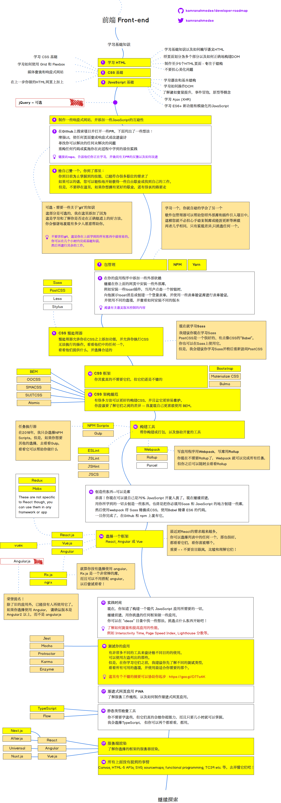
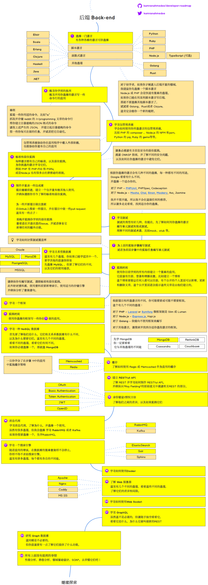
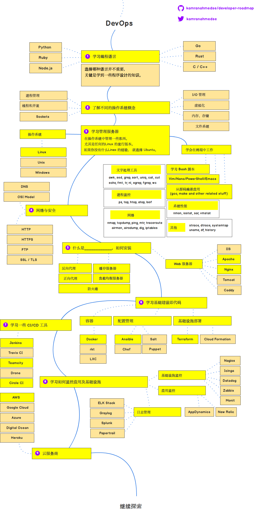

> 2018年 成为Web 开发者的路线图

下面是一组图表，展示了你可以采取的路径以及你希望采用的技术，以便成为前端，后端或devops。我为我的一位老教授制作了这些图表，他希望与大学生分享一些观点。

这是我的 [blog](http://kamranahmed.info) 和 [Twitter](https://twitter.com/kamranahmedse).

[English version](./readme.md)

## 免责申明
> 这份路线图的目的是让你了解全景，并指导你，而不是鼓励你选择时髦和时尚的东西，如果你对接下来要学习的东西感到困惑，你应该逐渐理解为什么一种工具比另一种更适合某些情况，并记住时髦和时尚从来不是最适合这份工作的。

## 🚀 介绍

## 🎨 前端路线图

## 👽 后端路线图

## 👷 开发运维路线图

## 🚦 友情提醒

如果你认为任何路线图都可以改进，请提交包含任何更新的PR并提交任何问题。此外，我将继续改进这一点，因此你可能希望观看/加注此存储库以重新访问。

## ☑ TODO

- [X] 添加 Frontend 路线图
- [X] 添加 Backend 路线图
- [X] 添加 DevOps 路线图
- [ ] 添加各项相关资源

## 👬 贡献

路线图文件是有 [Balsamiq](https://balsamiq.com/products/mockups/)编译的.工程文件是在 `/project` 目录中. 为修改任何项目, 打开 Balsamiq, 点击 **Project > Import > Mockup JSON**, 它会打开工程文件，更新它，上传文件、上传图片并提交PR.		

- poll PR 用于改进
- issues 用于讨论
- 传播这个地址
- 任何反馈请联系联系 

## 赞助

- [Hackr.io - Find & Share the Best Online Programming Courses & Tutorials](https://hackr.io)

## 许可证

