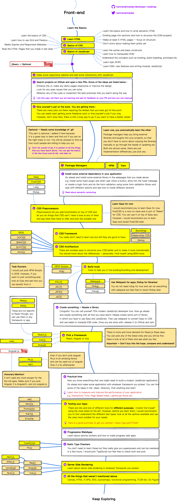
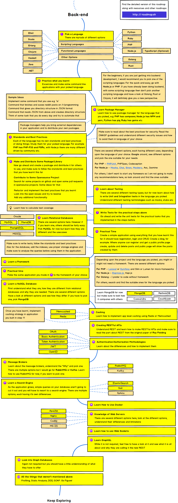
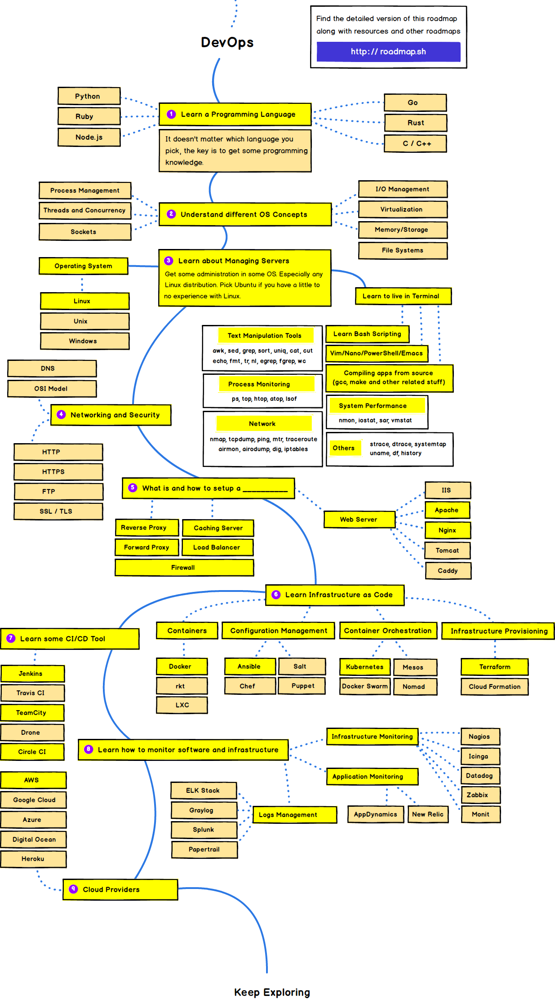

> Roadmap to becoming a web developer in 2018

Below you find a set of charts demonstrating the paths that you can take and the technologies that you would want to adopt in order to become a frontend, backend or a devops. I made these charts for an old professor of mine who wanted something to share with his college students to give them a perspective.

Check out my [blog](http://kamranahmed.info) and say "hi" on [Twitter](https://twitter.com/kamranahmedse).

## Disclaimer
> The purpose of this roadmap is to give you an idea about the landscape and to guide you if you are confused about what to learn next and not to encourage you to pick what is hip and trendy. You should grow some understanding of why one tool would better suited for some cases than the other and remember hip and trendy never means best suited for the job

## 🚀 Introduction

## 🎨 Frontend Roadmap

## 👽 Back-end Roadmap

## 👷 DevOps Roadmap

## 🚦 Wrap Up

If you think any of the roadmaps can be improved, please do open a PR with any updates and submit any issues. Also, I will continue to improve this, so you might want to watch/star this repository to revisit.

## ☑ TODO

- [X] Add Frontend Roadmap
- [X] Add Backend Roadmap
- [X] Add DevOps Roadmap
- [ ] Add relevant resources for each

## 👫 Contribution

> _**PRE-REQUISITE**: The roadmaps are built using [Balsamiq →](https://balsamiq.com/products/mockups/)_

1. 🤔 **WHERE**: Project file can be found at [`/project`](./project) directory
2. ⬇️ **IMPORT**: To modify any of the roadmaps, open Balsamiq, click <kbd>Project</kbd> ❯ <kbd>Import</kbd> ❯ <kbd>Mockup JSON</kbd>, put the relevant JSON file data from any roadmap in the [`/project`](./project) directory in Balsamiq
3. 😮 **WHAT**: This will open the relevant roadmap for you. Now update it (double-click to edit text) and make all the changes
4. ⬆️ **EXPORT**:
    1. 🖨 **JSON**: Export Mockup to JSON, click <kbd>Project</kbd> ❯ <kbd>Export</kbd> ❯ <kbd>Mockup to JSON</kbd> and update it in the [`/project`](./project) directory
    2. 🖼 **IMAGES**: Before exporting images, make the background transparent (click <kbd>Project</kbd> ❯ <kbd>Export</kbd> ❯ <kbd>Use Transparent Background</kbd>). Now export the images (click <kbd>Project</kbd> ❯ <kbd>Export</kbd> ❯ <kbd>All Mockups to PNG</kbd>). Update the relevant images (keep the same name so you don't have to edit the `README.md` file) in the [`/images`](./images) directory
5. 🚀 **PR**: Create a Pull Request for this repository (make sure to explain what you changed in the description)

- Open pull request with improvements
- Discuss ideas in issues
- Spread the word
- Reach out with any feedback 

## Sponsored By

- [Hackr.io - Find & Share the Best Online Programming Courses & Tutorials](https://hackr.io)

## License

