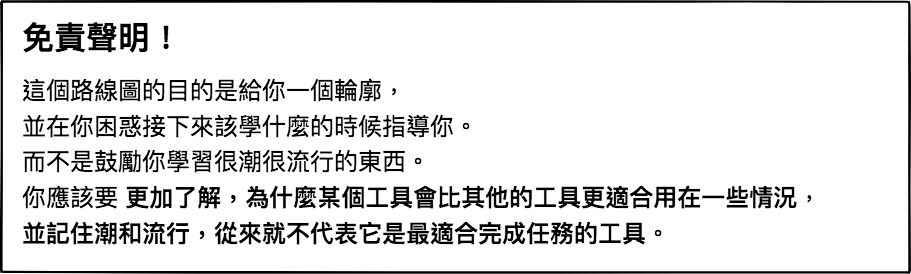

> 2018 年成為 Web 開發人員的路線圖

在下方，你會看到一系列的圖表，展示為了成為前端、後端或 DevOps 開發人員，你可以採取的路徑和你會想採用的技術。我為我的一位老教授做了這些圖表，他想和大學生分享一些東西，給他們一個視角。

如果你認為這些內容有任何方式可以改進，請提供建議。

 

  

 

看看我的[部落格](http://kamranahmed.info)，然後來 [Twitter](https://twitter.com/kamranahmedse) 說聲 "hi"。
（譯註：也歡迎來逛逛我的[部落格](http://goodjack.blogspot.com/)，然後來 [Twitter](https://twitter.com/littlegoodjack) 打個招呼 :P）

## 🚀 介紹

## 🎨 前端 Frontend 路線圖
> 譯註：尚未翻譯完成...

## 👽 後端 Back-end 路線圖

## 👷 DevOps 路線圖
> 譯註：尚未翻譯完成...

## 🚦 總結

如果你認為路線圖有可以改進的地方，請更新並開個 PR 或是送出 issue。另外，我也會繼續改進這個專案，所以你可能會想要 watch 或 star 這個專案以便再來觀看。

## ☑ TODO

- [X] 新增前端 Frontend 路線圖
- [X] 新增後端 Backend 路線圖
- [X] 新增 DevOps 路線圖
- [ ] 為每個項目新增相關的資源

## 👬 貢獻

這些路線圖是用 [Balsamiq](https://balsamiq.com/products/mockups/) 建構的。專案文件可以在 `/project` 目錄中找到。要修改任何路線圖, 請打開 Balsamiq，點選 **Project > Import > Mockup JSON**，它就會幫你開啟路線圖，更新他，在 readme 中上傳和更新這些圖片，並開啟一個 PR。

- 改進並開啟 Pull Request
- 在 Issue 中討論想法
- 分享出去
- 接受任何意見回饋 
- （關於中文翻譯）接受任何意見回饋 

## Sponsored By

- [Hackr.io - Find & Share the Best Online Programming Courses & Tutorials](https://hackr.io)
- [Highig - Think and its done](http://highig.com/)

## 授權條款

