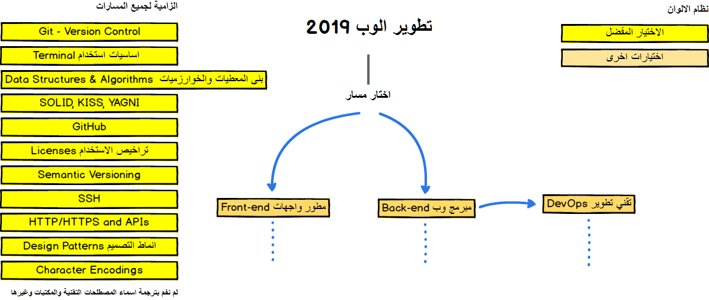
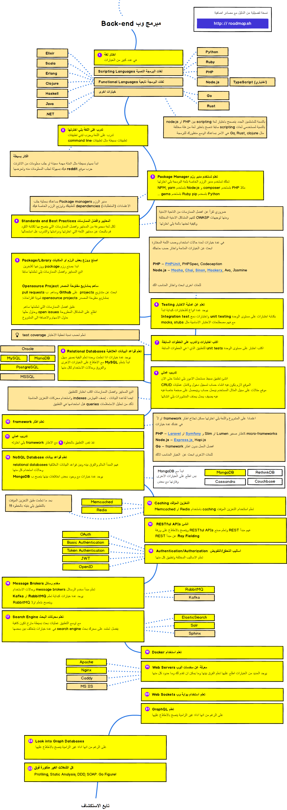
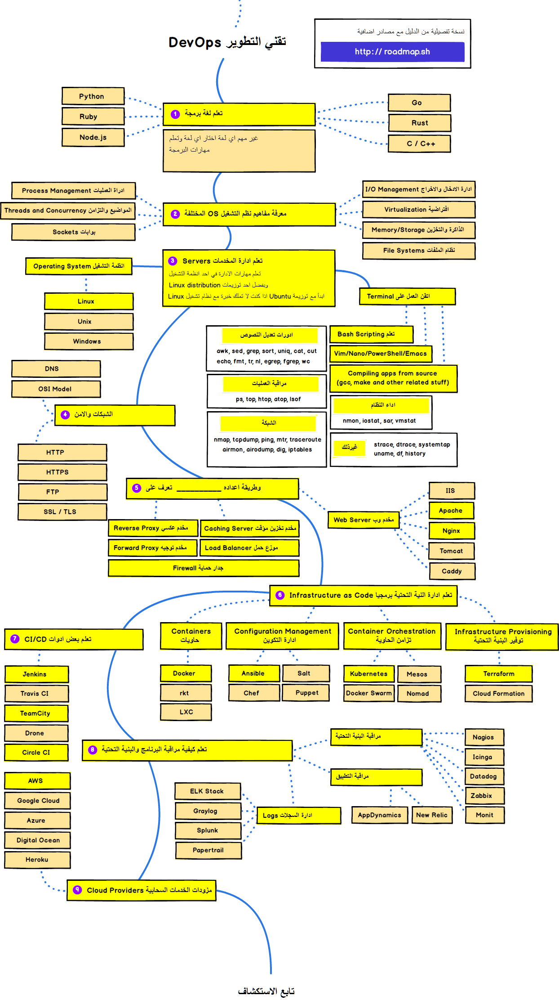

# دليلك لتطوير الوب 2019

مسار التعلم والتقنيات اللازمة لتصير مطور واجهات frontend او مبرمج وب backend او تقني تطوير devops

منرحب بأي اقتراحات او ملاحظات بتساهم بتطوير الدليل

***

<b> 🎉 العمل مستمر على تحديث الدليل 🎉 </b> 
لتبقى على اطلاع <a href="http://roadmap.sh">roadmap.sh</a>

***

> هدف الدليل اعطاء صورة عامة عن مجال تطوير الوب  لنساعدك تفهم وتبقى على اطلاع على اخر المجريات والتقنيات   الحديثة  
بس دائما تذكر التقنية الدارجة والاحدث لا تعني بالضرورة التقنية الافضل لمشروعك

## الترجمة

تمت الترجمة الى اللغة العربية بواسطة @shu3aybbadran  
لم تتم ترجمة المصطلحات واسماء التقنيات والمكتبات وغيرها من اللغة الانكليزية للاسباب التالية:

- ضرورة معرفة المتعلم للمصطلحات باللغة الانكليزية
- اغلب المصادر العربية والدورات لا تترجم المصطلح وتستعمله باللغة الانكليزية
- لا وجود لترجمة عربية متفق عليها

## مقدمة

## Frontend دليل مطور الواجهات

## Back-end دليل مبرمج الوب

## DevOps دليل تقني التطوير

## 🚦 ملخص

المشروع مستمر بالتطور لتلاقي احدث نسخة من الدليل تابع [roadmap.sh](http://roadmap.sh)  
اي اقتراحات او افكار لتطوير المشروع راجع دليل المساهمة او انشئ issues وناقش مع المساهمين

## 🙌 المساهمة

> اطلع على [دليل المساهمة](./contributing.md) لتفاصيل التعديل او المساهمة

- انشئ pull request مع التعديلات المقترحة
- لمناقشة اي افكار او اسئلة انشئ issues
- انشر الدليل
- لابداء اي ملاحظات 

## رخصة الاستخدام

