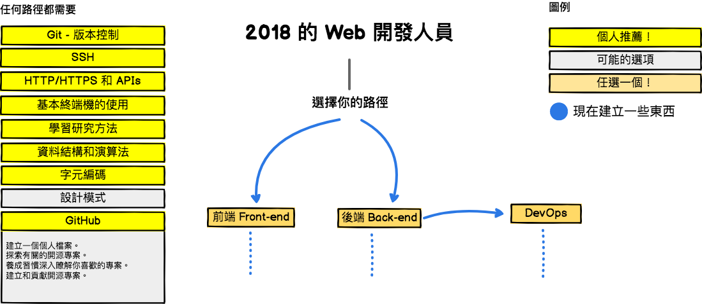
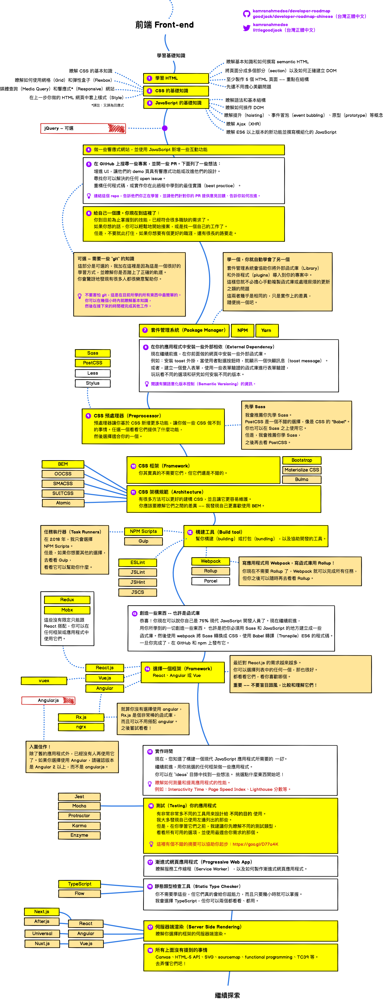
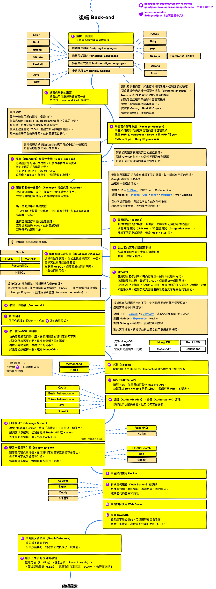
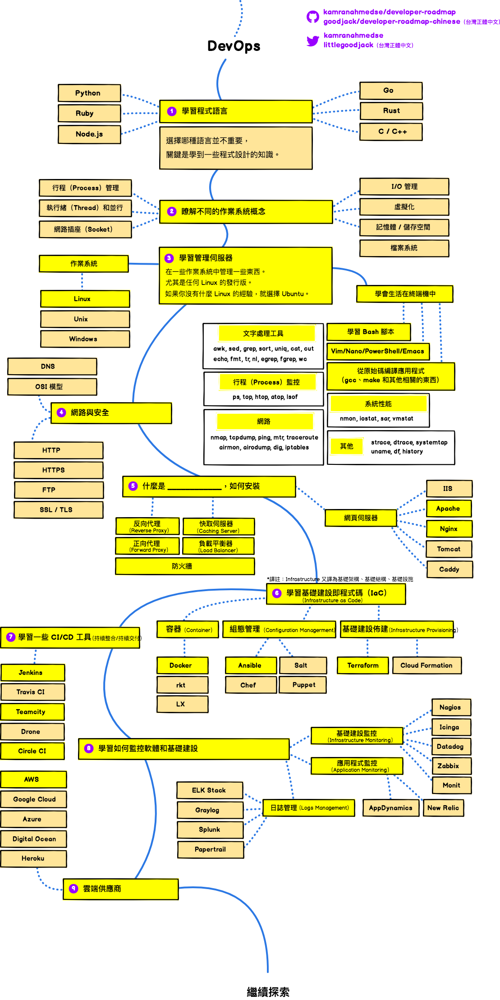

> 2018 年成為 Web 開發人員的路線圖

在下方，你會看到一系列的圖表，展示為了成為前端、後端或 DevOps 開發人員，你可以採取的路徑和你會想採用的技術。我為我的一位老教授做了這些圖表，他想和大學生分享一些東西，給他們一個觀點。

看看我的[部落格](http://kamranahmed.info)，然後來 [Twitter](https://twitter.com/kamranahmedse) 說聲 "hi"。 
（譯註：也歡迎來逛逛譯者的[部落格](http://goodjack.blogspot.com/)，然後來 [Twitter](https://twitter.com/littlegoodjack) 打個招呼 :P）

## 🌏 台灣正體中文翻譯前言
嗨大家好我是小克 👋，從 2017 年開始注意到這個 repo 覺得獲益良多，所以就試著翻譯看看，分享給更多需要的人。由於這裡是翻譯 repo，關於內容的任何建議，推薦你直接回饋給 [kamranahmedse/developer-roadmap](https://github.com/kamranahmedse/developer-roadmap)，當然需要我協助也是可以的 :D

這裡的中文都盡量使用 **台灣用語及術語**，資訊相關的術語都會在翻譯旁保留原文供參考。中文排版皆盡可能地依循 [**中文文案排版指北**](https://github.com/sparanoid/chinese-copywriting-guidelines)（若有不符的地方請跟我說）。

這是我第一次翻譯，難免有疏漏、語意不順、用詞不精準及翻譯錯誤的地方，如果有任何可以改進之處，都非常歡迎開 issue 或 PR！

當然，若原作有更新，也歡迎開 issue 告知，或 PR 協助翻譯，謝謝！

接受任何意見回饋 

小小的推廣拙作：[小克的 Visual Studio Code 必裝擴充套件（Extensions）私藏推薦](http://goodjack.blogspot.com/2018/03/visual-studio-code-extensions.html)

## 免責聲明
> 這個路線圖的目的是給你一個輪廓，並在你困惑接下來該學什麼的時候指導你。而不是鼓勵你學習很潮很流行的東西。你應該要更加了解，為什麼某個工具會比其他的工具更適合用在一些情況，並記住潮和流行，從來就不代表它是最適合完成任務的工具。

## 🚀 介紹

## 🎨 前端 Frontend 路線圖

## 👽 後端 Back-end 路線圖

## 👷 DevOps 路線圖

## 🚦 總結

如果你認為路線圖有可以改進的地方，請更新並開個 PR 或是送出 issue。另外，我也會繼續改進這個專案，所以你可能會想要 watch 或 star 這個專案以便再來觀看。

## ☑ TODO

- [X] 新增前端 Frontend 路線圖
- [X] 新增後端 Backend 路線圖
- [X] 新增 DevOps 路線圖
- [ ] 為每個項目新增相關的資源

## 👬 貢獻

這些路線圖是用 [Balsamiq](https://balsamiq.com/products/mockups/) 建構的。專案文件可以在 `/project` 目錄中找到。要修改任何路線圖，請打開 Balsamiq，點選 **Project > Import > Mockup JSON**，它就會幫你開啟路線圖，更新他，在 readme 中上傳和更新這些圖片，並開啟一個 PR。

- 改進並開啟 Pull Request
- 在 Issue 中討論想法
- 分享出去
- 接受任何意見回饋 
- （關於中文翻譯）接受任何意見回饋 

## Sponsored By

- [Hackr.io - Find & Share the Best Online Programming Courses & Tutorials](https://hackr.io)

## 授權條款

