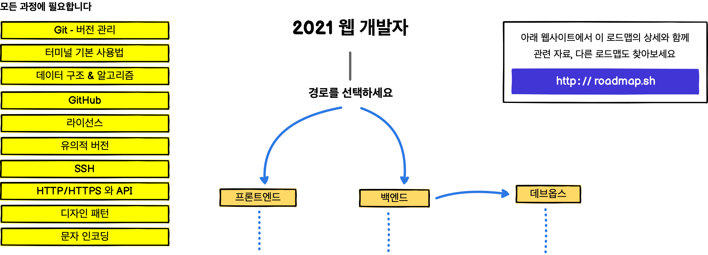
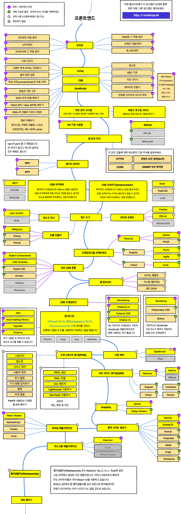
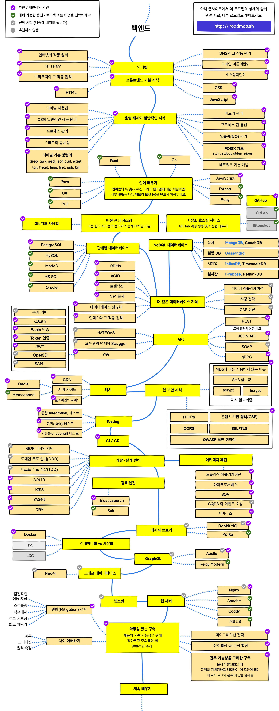
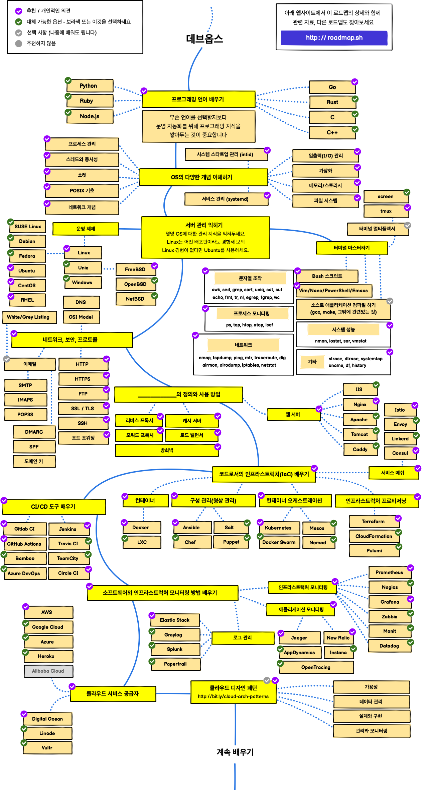

> 2020년, 웹 개발자가 되기 위한 로드맵

웹 개발자 로드맵은 웹 개발자가 되기 위해 선택하고 거쳐야 할 기술과 순서를 프론트엔드, 백엔드, 데브옵스의 세 개의 경로로 나누어 제공합니다. 이 로드맵은 학생들이 시야를 넓혔으면 하는 저의 옛 교수님을 위해 만든 것으로, 커뮤니티에도 도움이 되고자 공개합니다.

***

<h3 align="center"><strong>이 로드맵의 목적</strong></h3>

> 이 로드맵은 웹 개발에 대한 전체적인 방향과 함께 앞으로 무엇을 배워야 할지를 안내하며 몇몇 도구가 그저 힙하거나 유행이라는 이유만으로 배우는 것은 피하고자 함에 목적이 있습니다. 어떤 도구가 다른 도구보다 어떤 경우에 더 적합한지 그 이유를 이해하고, 기술의 힙함이나 유행은 작업에 가장 적합한 이유가 될 수 없음을 기억해야 하겠습니다.

<h3 align="center"><strong>초보자를 위한 안내</strong></h3>

> 이 로드맵은 아래 나열된 경로에 대해 학습할 수 있는 모든 것을 담고 있습니다. 그렇다고 부담스러워 하지 마세요. 시작이 반이고 처음부터 전부 배울 필요는 없습니다. 현재 초보자용 로드맵을 제작 중이며 2020년 백엔드와 데브옵스 로드맵 공개 이후에 [곧이어 보여드릴 예정입니다](https://roadmap.sh).

***

개선에 대한 어떠한 제안도 환영합니다.

## 로드맵 안내

## 프론트엔드 로드맵

 

## 백엔드 로드맵

 

## 데브옵스 로드맵

 

## 🚦 마치며

로드맵 개선에 대해서는 이슈를 통해 자유롭게 의견을 남겨 주세요. 향후 개선은 저장소를 Watch 상태 전환 또는 [roadmap.sh](http://roadmap.sh)에서 구독을 통해 확인하실 수 있습니다.

## 🙌 기여하기

> 로드맵 업데이트 방법은 [기여 문서(영어)](../../CONTRIBUTING.md)를 참조하세요.

- 개선 사항은 풀 요청에 남겨 주세요
- 의견이 있는 경우 이슈에 참여해 주세요
- 널리 공유해 주세요
- 피드백을 보내 주세요 

## 라이선스

세부 사항은 [라이선스 파일(영어)](../../LICENSE)을 참조하세요.
