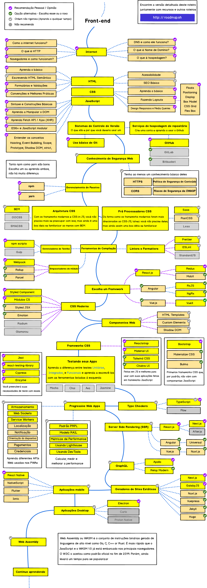
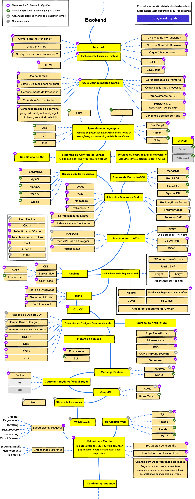
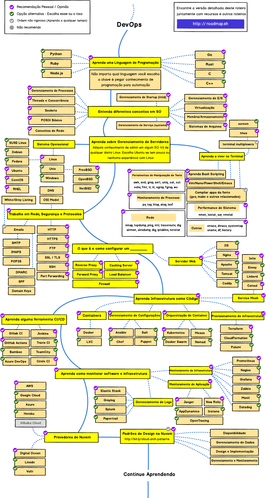

> Roteiro para se tornar um desenvolvedor web em 2021

Abaixo você encontra um conjunto de gráficos demonstrando os caminhos que você pode que você pode tomar e as tecnologias que você pode querer adotar a fim de se tornar um(a) desenvolvedor(a) frontend, backend ou um(a) DevOps. Eu ([kamranahmeds](https://github.com/kamranahmedse)) fiz esses gráficos para um velho professor meu que queria algo para compartilhar com seus alunos da faculdade para dar a eles uma perspectiva; os compartilho aqui para ajudar a comunidade.

***

		Anúncio especial:
		 
		
		 
		<b>Nós agora temos um Canal no Youtube</b>
		 
		Eu planejo cobrir os roteiros e colocar mais conteúdo lá <a href="https://www.youtube.com/channel/UCA0H2KIWgWTwpTFjSxp0now?sub_confirmation=1">Se inscreva no canal</a>.

***

<h3 align="center"><strong>Propósito desses Roteiros</strong></h3>

> O propósito desses Roteiros é dar a você uma ideia sobre o panorama e te guiar se você está confuso sobre o que aprender depois e não te encorajar a escolher o que está na moda. Você deve começar a entender o porquê de uma ferramenta seria melhor em alguns casos que outra e se lembrar de na moda nunca significa melhor adequada para o trabalho.

<h3 align="center"><strong>Observação a Iniciantes</strong></h3>

> Estes roteiros cobrem tudo que tem para aprender para os caminhos listados abaixo. Não se sinta sobrecarregado(a), você não precisa aprender tudo no começo se você está apenas começando. Nós estamos trabalhando nas versões iniciantes dessas e [serão lançadas em breve](https://roadmap.sh) depois que nós tivermos terminado com o lançamento dos roteiros de Backend e DevOps de 2021.

***

Se você acha que estes podem ser melhorados de qualquer jeito, por favor sugira como.

## Introdução

## Roteiro Frontend 

## Roteiro Backend

## Roteiro DevOps

## 🚦 Para Finalizar

Se você acredita que os roteiros podem ser melhorados, sinta-se livre para discutir sobre nas issues. Além disso, eu vou continuar a melhorar isto, então você talvez queira clicar em watch ali em cima ou se inscrever em [roadmap.sh](http://roadmap.sh) para revisitar.

## 🙌 Contribuição

> Dê uma olhada nos [documentos de contribuição](https://github.com/kamranahmedse/developer-roadmap/blob/master/CONTRIBUTING.md) para saber como melhorar qualquer um dos roteiros

- Abra uma pull request com melhoramentos
- Discuta ideias em issues
- Espalhe a palavra
- Entre em contato com qualquer feedback 
 
## Licença

Dê uma olhada no [arquivo de licença](https://github.com/kamranahmedse/developer-roadmap/blob/master/LICENSE) para detalhes
