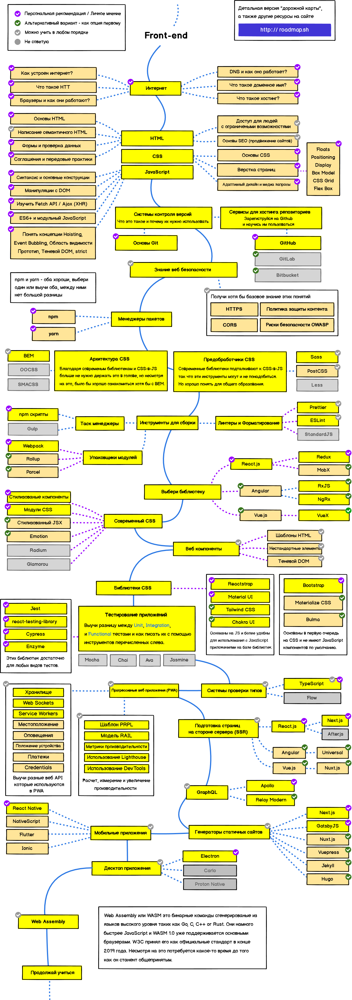

## developer-roadmap
> "Дорожная карта" веб разработчика в 2020 году

## "Дорожная карта" Frontend разработчика

## "Дорожная карта" Backend разработчика

> [Help us translate](https://github.com/kamranahmedse/developer-roadmap/issues/669)

## "Дорожная карта" DevOps'а

> [Help us translate](https://github.com/kamranahmedse/developer-roadmap/issues/669)
