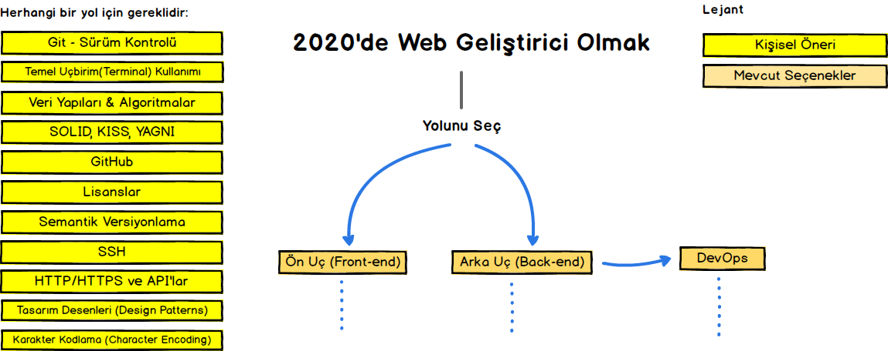
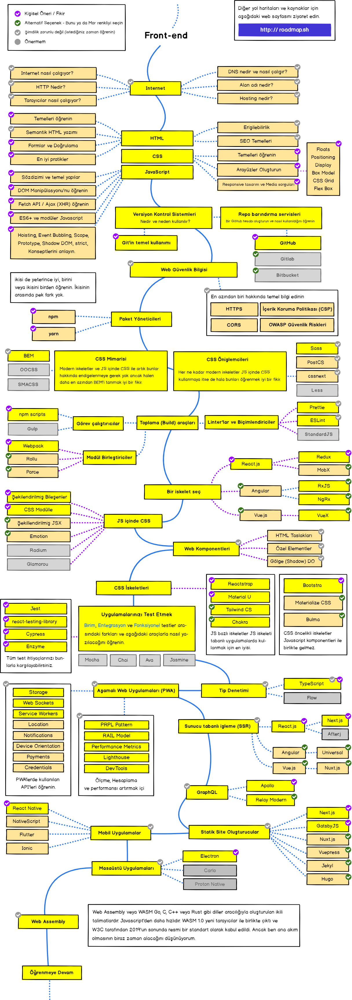
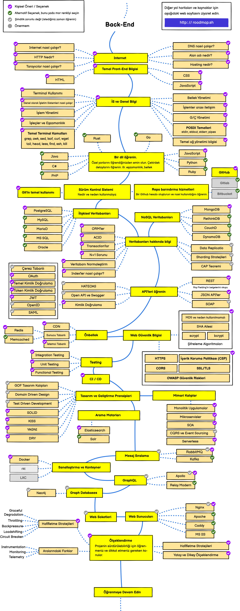
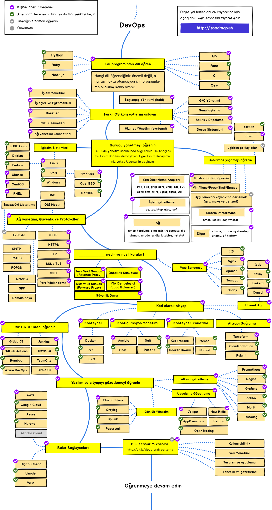

> 2020'de Web geliştirici olmanın yol haritası

Aşağıda Ön Uç (Front-end), Arka Uç (Back-end) ve Devops geliştirici olmak için öğrenmeniz gereken teknolojileri açıklayan tablolar göreceksiniz. Bu tablolar Kamran Ahmed'in "Web Developer Roadmap" dokümanından birebir çevirilmiştir.

***

<h3 align="center"><strong>Bu yol haritalarının amacı</strong></h3>

> Bu yol haritalarının amacı size bu alan hakkında bir fikir vermek ve kafa karışıklığınızı önlemektir, trend ve popüler olan teknolojiyi seçmeniz hakkında sizi motive etmemektedir. Hangi aracın sizin kullanım amacınza uygun olduğunu kendiniz bir fikir geliştirmelisiniz. Bir teknolojinin trend veya popüler olması yapacağınız iş için en uygun olduğu anlamına gelmez.

<h3 align="center"><strong>Yeni Başlayanlara Not</strong></h3>

> Bu yol haritaları öğrenilecilecek her şeyi ve öğrenmek için izlemeniz gereken yolu açıklamaktadır. Kendinizi bunalmış hissetmeyin. Başlangıçta bunların hepsini öğrenmek zorunda değilsiniz. Şu anda bu yol haritalarının yeni başlayanlara özel sürümleri üzerinde çalışıyoruz ve bunları 2020 Backend ve Devops yol haritalarının tamamlanmasının ardından [yayınlayacağız](https://roadmap.sh).

***

## Giriş

## Ön Uç (Front-end) Yol Haritası

## Arka Uç (Back-end) Yol Haritası

## DevOps Yol Haritası

## 🚦 Son Olarak

Eğer yol haritalarının daha fazla geliştirilebileceğini düşünüyorsanız lütfen güncellemeler için PR açın ve sorunları Issues sekmesi altında bildirin. Ayrıca ben de geliştiriyor olacağım, dolayısıyla bu repo'yu tekrar ziyaret etmek üzere izleyebilir/yıldızlayabilirsiniz.
