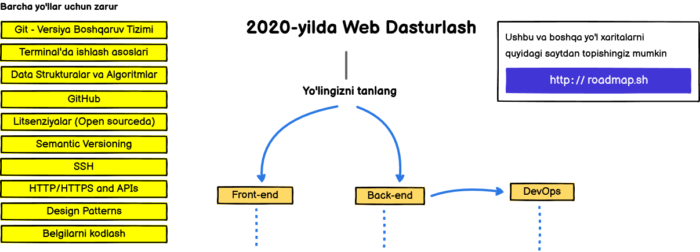
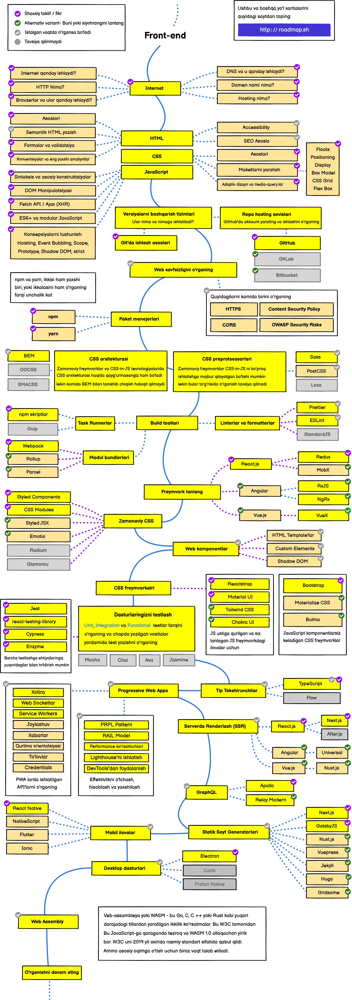
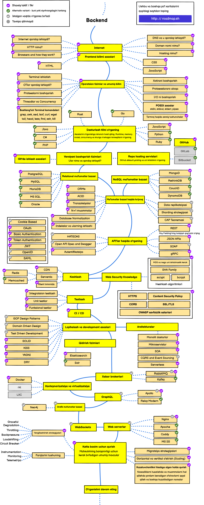
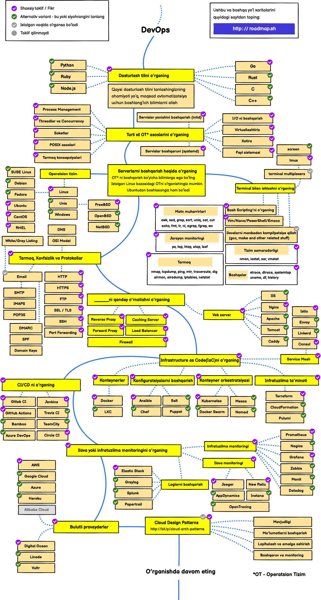

## developer-roadmap
> 2021-yilda Web dasturchi "yo'l xaritasi"

## Kirish

## Frontend dasturchi "yo'l xaritasi"

## Backend dasturchi "yo'l xaritasi"

## DevOps "yo'l xaritasi"

## 🚦 
Agar siz biron bir yo'l xaritasini yaxshilash mumkin deb hisoblasangiz, uni Issue'larda muhokama qilishdan qo'rqmang.
